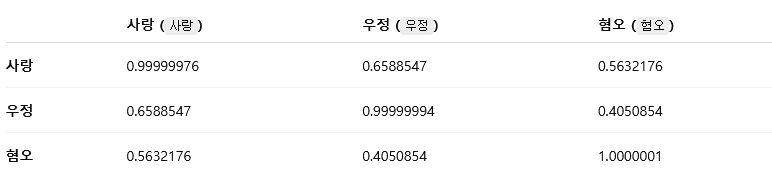

# 임베딩 모델 안내 (검색 기획/개발자용)

이 문서는 본 프로젝트에서 사용하는 임베딩 모델과 설정 방법을 설명합니다.
검색 기획자와 검색 개발자가 함께 이해할 수 있도록, 목적/효과/운영 관점까지 정리했습니다.

## 1. 임베딩 모델이 하는 일
임베딩 모델은 **문장을 숫자 벡터로 바꾸는 모델**입니다.
이 벡터를 기반으로 “의미가 가까운 상품”을 찾는 것이 벡터 검색의 핵심입니다.

- 입력: 사용자의 검색어 또는 상품 설명 텍스트
- 출력: 고정 길이의 숫자 벡터
- 사용 위치: Elasticsearch `dense_vector` 필드에 저장 및 `knn` 검색에 사용

즉, **문자열을 “의미 좌표”로 바꿔주는 변환기**라고 생각하면 됩니다.

## 1-1. DJL이란?
DJL(Deep Java Library)은 **Java에서 딥러닝 모델을 쉽게 사용하기 위한 라이브러리**입니다.
이 프로젝트에서는 DJL이 다음 역할을 합니다.

- Hugging Face에 있는 임베딩 모델을 다운로드/로딩
- 텍스트를 임베딩 벡터로 변환(추론)

즉, **Java 코드에서 AI 모델을 직접 불러 쓰게 해주는 “연결 고리”**라고 이해하면 됩니다.

## 2. 현재 사용 모델
현재 기본 모델은 다음과 같습니다.

- 모델: `sentence-transformers/paraphrase-multilingual-MiniLM-L12-v2`
- 지원 언어: 다국어(한국어 포함)
- 특성: 가볍고 빠른 모델, 의미 유사도 검색에 적합

설정 위치는 `application.yml`의 다음 항목입니다.

```yaml
aio-search:
  embedding-model-url: djl://ai.djl.huggingface.pytorch/sentence-transformers/paraphrase-multilingual-MiniLM-L12-v2
```

이 값이 **임베딩 모델의 “실제 출처”를 가리키는 문자열**이며, DJL이 이 값을 해석해서 모델을 다운로드/로딩합니다.

## 3. 설정 값(embedding-model-url)의 의미
`embedding-model-url`은 **DJL이 지원하는 모델 로딩 경로**입니다.

현재 사용 값의 의미는 다음과 같습니다.

- `djl://` : DJL 전용 모델 경로 스킴
- `ai.djl.huggingface.pytorch` : Hugging Face의 PyTorch 모델 저장소 사용
- `sentence-transformers/paraphrase-multilingual-MiniLM-L12-v2` : 실제 모델 이름

- 다국어를 지원하는 paraphrase-multilingual-MiniLM-L12-v2의 경우 유사도 표현이 좀 더 보수적인 경향이 눈에 띕니다.

- paraphrase-multilingual-MiniLM-L6-v2


- paraphrase-multilingual-MiniLM-L12-v2



- 사랑-우정 사이의 유사도 하락이 그 예시죠.
- all-MiniLM-L6-v2의 경우에는 "The project aims to train sentence embedding models on very large sentence level datasets using a self-supervised contrastive learning objective" 라고 밝히고 있습니다. 목적 또한 데이터셋을 찾아보면 일반적인 영어 문장에 최적화 되어있음을 밝힙니다.

https://huggingface.co/sentence-transformers/all-MiniLM-L6-v2

이 값을 바꾸면 **임베딩 모델을 교체할 수 있습니다**. 코드 수정 없이 설정만 바꾸는 구조입니다.

## 4. 검색 기획 관점에서의 의미
임베딩 모델은 **“검색 품질의 방향성”**을 결정합니다.

- 더 정확한 모델: 의미 유사도는 좋아지지만 속도/비용이 증가할 수 있음
- 더 가벼운 모델: 속도는 빠르지만 의미 매칭이 덜 섬세할 수 있음

따라서 **검색 기획 단계에서 요구하는 품질/속도/운영 비용 기준**이
모델 선택에 직접 영향을 줍니다.

예시:
- “간식”과 “스낵”을 같은 의미로 이해해야 한다 → 의미 유사도 모델 필요
- 검색 응답 속도가 매우 중요하다 → 경량 모델 필요

## 5. 검색 개발 관점에서의 의미
검색 개발자는 **모델 차원 수, 성능, 인덱싱 비용**을 고려해야 합니다.

- 임베딩 차원 수가 늘면 인덱스 용량이 증가합니다.
- 모델이 무거우면 인덱싱 시간/검색 응답이 느려집니다.
- 모델이 바뀌면 인덱스를 다시 만들어야 합니다.

즉, 모델 변경은 **검색 품질 + 운영 비용**에 직접 영향을 줍니다.

## 6. 이 프로젝트에서 모델이 쓰이는 흐름
1. `application.yml`에서 `embedding-model-url`을 읽음
2. `DjlEmbeddingService`가 해당 URL로 모델을 로딩
3. 상품 텍스트와 검색어를 임베딩 벡터로 변환
4. Elasticsearch에 벡터 저장 + `knn` 검색 수행

관련 코드 위치:
- `src/main/java/com/example/aisearch/service/DjlEmbeddingService.java`
- `src/main/resources/application.yml`

## 7. 모델 교체 시 체크리스트
모델을 바꿀 경우 아래 항목을 꼭 확인해야 합니다.

- 모델이 한국어 의미 검색에 충분한지
- 모델 크기(다운로드/메모리)가 운영 환경에 적합한지
- 임베딩 차원 수가 달라졌는지
- 인덱스를 재생성해야 하는지
- 테스트 검색 품질이 기대 수준인지

## 8. 추천 운영 방식
- 개발 초기에는 현재 모델처럼 가벼운 모델로 빠르게 반복
- 품질 이슈가 확인되면 더 강한 모델로 교체 검토
- 모델 교체 시 검색 품질 지표(클릭/전환)와 응답 시간 지표를 같이 평가

---

필요하면 모델별 비교표(속도/메모리/정확도)도 추가할 수 있습니다.
