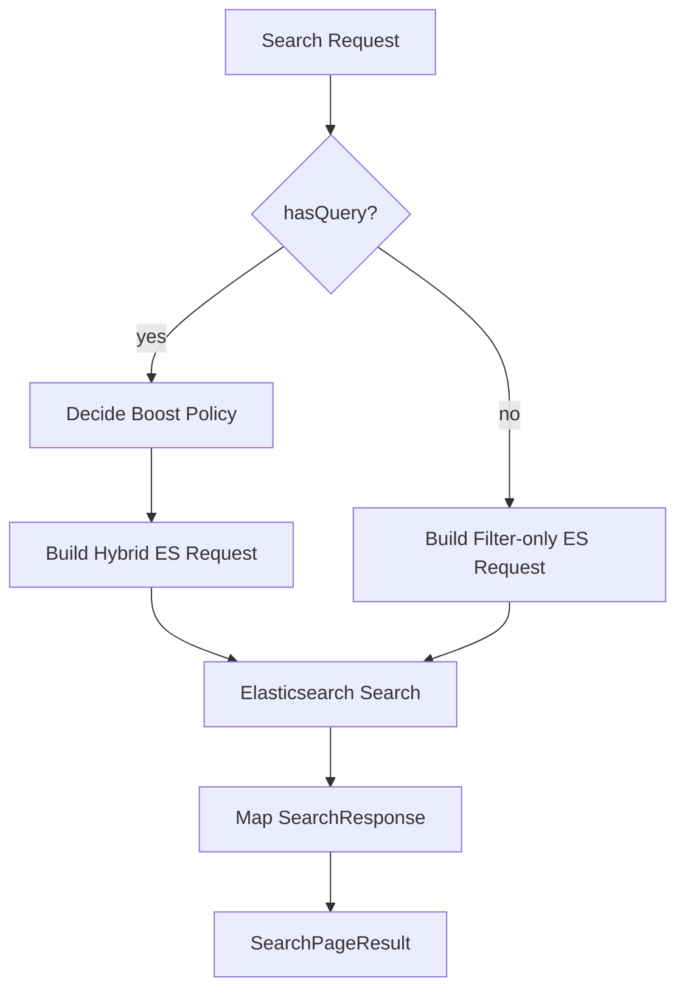
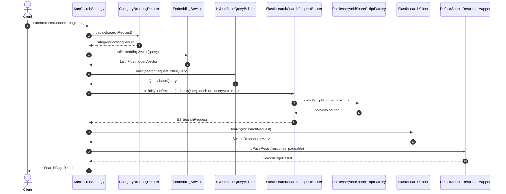
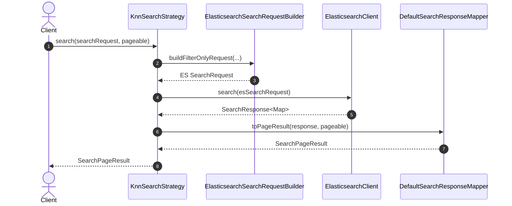
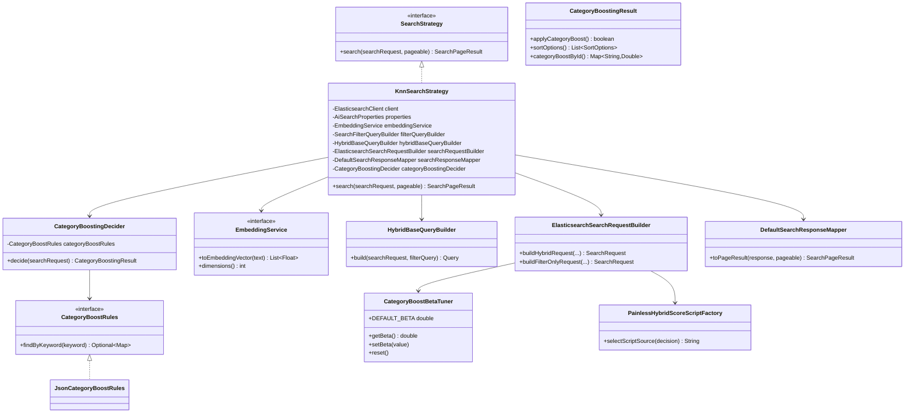

# 12. 카테고리 부스팅 코드 설명

이 문서는 카테고리 부스팅 로직의 **구조(클래스 관계)**와 **동작(호출 흐름)**을 코드 기준으로 설명한다.
수식/점수 공식은 `11.카테고리_부스팅.md`를 참고한다.

## 1) 고수준 흐름 (개념)

## 2) 시퀀스 다이어그램 (호출 순서)

### 2-1. Query 있는 경우

### 2-2. Query 없는 경우

## 3) 클래스 다이어그램 (정적 구조)

## 4) 클래스별 핵심 책임

- `KnnSearchStrategy`: 검색 분기/오케스트레이션
- `CategoryBoostingDecider`: 부스팅 적용 여부 + 최종 정렬 결정
- `ElasticsearchSearchRequestBuilder`: ES 요청 조립(script params, sort, paging, min_score)
- `PainlessHybridScoreScriptFactory`: 점수 계산 스크립트 source 제공
- `HybridBaseQueryBuilder`: 하이브리드 base bool 쿼리 생성
- `DefaultSearchResponseMapper`: ES 응답 -> API 응답 매핑
- `CategoryBoostBetaTuner`: beta 런타임 조정

## 5) 리팩터링 포인트 요약

- `KnnSearchStrategy`에서 script 문자열/요청 조립/응답 매핑 책임 분리
- 구조 분리 후, 전략 클래스는 "흐름 제어"에 집중
- 변경 시 수정 지점이 명확해져 유지보수성과 테스트 안정성 개선
